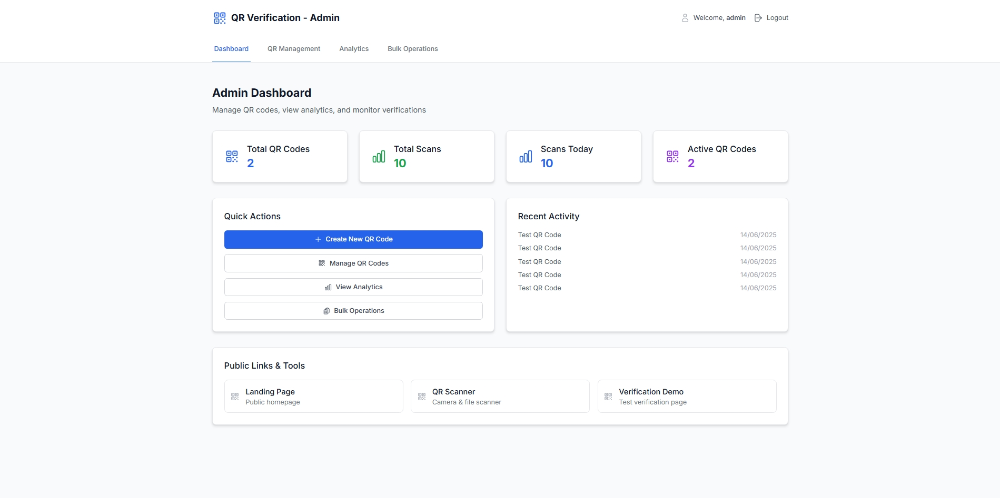
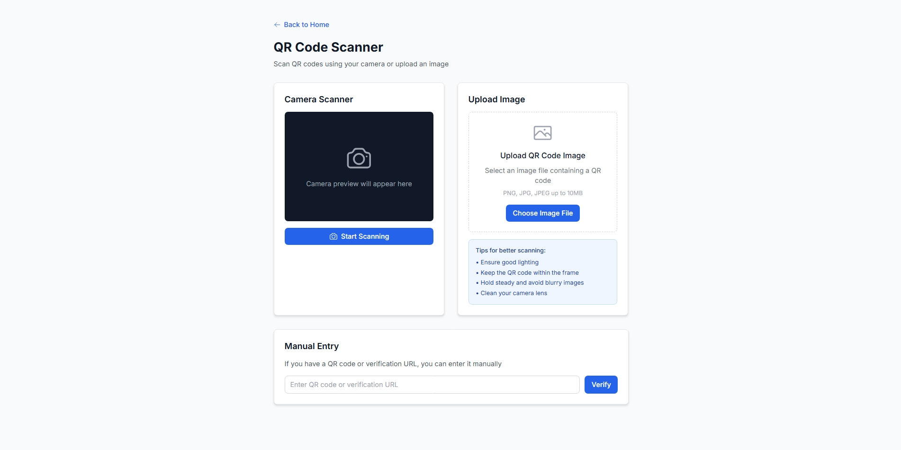
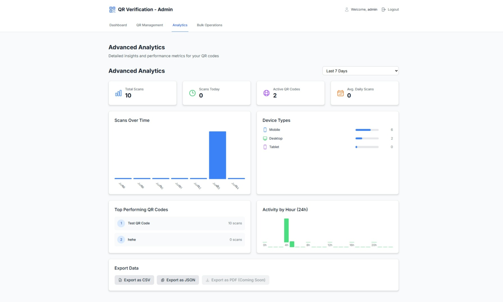

# 🎯 QR Verification System

Modern QR Code verification system built with PERN Stack (PostgreSQL, ExpressJS, ReactJS + Vite, NodeJS).

## ✨ Features

- 🔐 **Admin Authentication** - Secure JWT-based login
- 📱 **QR Generation** - Create custom QR codes with various data types
- 📸 **Camera Scanning** - Real-time QR code scanning with camera
- 📊 **Analytics Dashboard** - Real-time statistics and insights
- 📤 **Export Functions** - CSV/JSON export capabilities
- 🎨 **Responsive Design** - Mobile-first UI with Tailwind CSS
- ⚡ **Real-time Updates** - Live dashboard with Supabase

## 🛠️ Tech Stack

**Frontend:**

- React 19 + Vite
- Tailwind CSS + HeadlessUI
- Zustand (State Management)
- React Router Dom
- @zxing/library (QR Scanning)

**Backend:**

- Node.js + Express
- Supabase (PostgreSQL)
- JWT Authentication
- QRCode.js

**Deployment:**

- Vercel (Frontend + Serverless Functions)
- Supabase (Database & Storage)

## 📱 Demo

🔗 **Live Demo:** [https://your-demo-url.vercel.app](https://your-demo-url.vercel.app)

### Demo Credentials:

- **Username:** `demo`
- **Password:** `demo123`

## 🚀 Local Development

### Prerequisites

- Node.js 16+
- npm/yarn

### Installation

1. **Clone the repository**

```bash
git clone https://github.com/yourusername/qr-verification-portfolio.git
cd qr-verification-portfolio
```

2. **Install dependencies**

```bash
# Install root dependencies
npm install

# Install client dependencies
cd client && npm install

# Install server dependencies
cd ../server && npm install
```

3. **Environment Setup**

```bash
# Copy environment files
cp client/.env.example client/.env
cp server/.env.example server/.env

# Edit .env files with your Supabase credentials
```

4. **Run development servers**

```bash
# From root directory
npm run dev
```

## 📊 Project Structure

```
qr-verification-system/
├── client/                 # React Frontend
│   ├── src/
│   │   ├── components/     # React Components
│   │   ├── services/       # API Services
│   │   ├── store/          # Zustand Store
│   │   └── styles/         # CSS Styles
├── server/                 # Express Backend
│   ├── controllers/        # Business Logic
│   ├── routes/            # API Routes
│   ├── middleware/        # Auth & Validation
│   └── config/            # Database Config
└── vercel.json            # Deployment Config
```

## 🔧 Environment Variables

Create `.env` files based on `.env.example`:

**Client (`client/.env`):**

```env
VITE_SUPABASE_URL=your_supabase_url
VITE_SUPABASE_ANON_KEY=your_anon_key
VITE_API_URL=your_api_url
```

**Server (`server/.env`):**

```env
NODE_ENV=development
JWT_SECRET=your_jwt_secret
SUPABASE_URL=your_supabase_url
SUPABASE_SERVICE_KEY=your_service_key
```

## 📸 Screenshots

### Admin Dashboard



### QR Scanner



### Analytics



## 🤝 Contributing

1. Fork the project
2. Create your feature branch (`git checkout -b feature/AmazingFeature`)
3. Commit your changes (`git commit -m 'Add some AmazingFeature'`)
4. Push to the branch (`git push origin feature/AmazingFeature`)
5. Open a Pull Request

## 📄 License

This project is licensed under the MIT License - see the [LICENSE](LICENSE) file for details.

## 👨‍💻 Author

**Your Name**

- GitHub: [@yourusername](https://github.com/rehaansekap)
- LinkedIn: [Your LinkedIn](https://linkedin.com/in/rehanseekap)

## 🙏 Acknowledgments

- [Supabase](https://supabase.com) for the amazing backend platform
- [Vercel](https://vercel.com) for seamless deployment
- [Tailwind CSS](https://tailwindcss.com) for beautiful styling
